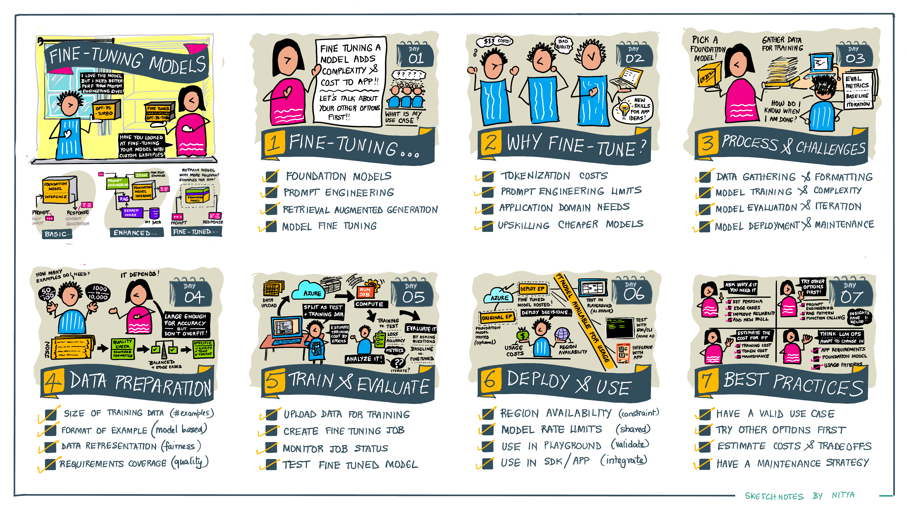

# Welcome

## Learning Objectives

Here's what you will learn by the end of this workshop.

## Generative AI For Beginners

Want a quick introduction to generative AI concepts? Check out the [Generative AI for Beginners](https://aka.ms/genai-beginners) curriculum that takes you from prompt-engineering to productiond deployments with various hands-on applications. Check out [Lesson 18](https://github.com/microsoft/generative-ai-for-beginners/blob/main/18-fine-tuning/README.md) for an introduction to fine-tuning.

!!! example "Fine Tuning: The Big Picture"

    

!!! tip "Watch the Video"

    In this 20-minute lesson, I walk through the fine-tuning fundamentals with a toy example (something that can complete the fine-tuning within an hour or so) using an OpenAI model. You can walk through this yourself with [the Jupyter notebook](https://github.com/microsoft/generative-ai-for-beginners/tree/main/18-fine-tuning/python/openai) that comes with the course.

    <iframe width="800" height="425" src="https://www.youtube.com/embed/6UAwhL9Q-TQ?list=PLlrxD0HtieHj2nfK54c62lcs3-YSTx3Je" title="Fine-Tuning LLMs [Pt 18] | Generative AI for Beginners" frameborder="0" allow="accelerometer; autoplay; clipboard-write; encrypted-media; gyroscope; picture-in-picture; web-share" referrerpolicy="strict-origin-when-cross-origin" allowfullscreen></iframe>

## Learning Resources 

This section will be updated with the key resources used in **this** workshop 
    